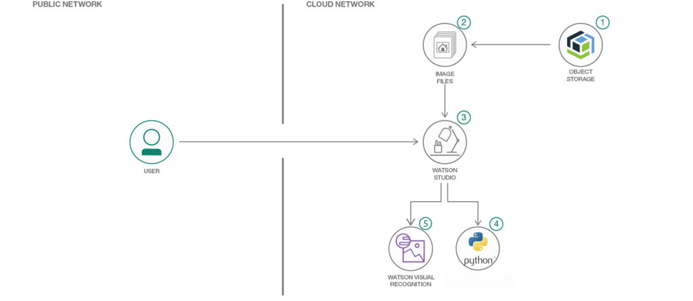

# Workshop sobre Watson Visual Recognition - Como prevenir accidentes de transito mediante el reconocimiento de imagenes

<p align="center">
  
</p>

## Flujo

* Crear una instancia del servicio en IBM Cloud.
* Crear las clases para este ejemplo, cargando las imágenes correspondientes descargadas previamente.
* Entrenar el modelo.
* Testear el modelo.
* Utilizando Python + OpenCV pruebe la API del serivicio para identificar rostros, obtener sus posiciones en la imagen, recortarlos y clasificarlos.

## Resumen

Actualmente la inteligencia artificial es una de las temáticas que mas interesa en la comunidad científica, y en concreto el campo del análisis de imágenes tiene un interés especial ya que sus aplicaciones son muy variadas y útiles. 
Entonces, profundizando en el procesamiento de imágenes nos encontramos con el reconocimiento facial, temática que es considerada una de las aplicaciones mas prometedoras. Pero no es todo color de rosas ya que como aspecto negativo se destaca el problema de que una aplicación robusta de reconocimiento facial debería reconocer una identidad a pesar de las muchas variaciones que la apariencia de los rostros humanos van teniendo a lo largo del tiempo.

Por lo tanto, en este caso concreto aplicaremos un procedimiento de reconocimiento facial a través de una de las variantes que nos ofrece la cartera de IBM como lo es Watson Visual Recognition para identificar cuando una persona que va manejando se duerme, para de esta forma poder actuar en pos de prevenir accidentes de transito.


## Descripción

Una aplicación de reconocimiento facial robusta debe reconocer una identidad a pesar de las muchas variaciones en la apariencia que la cara puede tener en una escena. En este caso concreto, debemos reconocer determinados patrones que nos permitan determinar que el conductor se durmió para de esta forma poder disparar algún mecanismo para evitar que se produzca un choque.
Entonces, en este workshop utilizaremos el servicio de clasificación que nos provee Watson Visual Recognition para identificar rostros que tengan los ojos cerrados, de esta forma, siendo capaces de reconocer esto podríamos implementar un algoritmo que sea capaz de detectar que una persona se durmió, por ejemplo analizando las imágenes obtenidas desde un video que se genere mediante una cámara ubicada en el vehículo. 


Lamentablemente la implementación de una solución completa de este estilo escapa del alcance de este workshop por lo cual nos centraremos en mostrar como clasificar imágenes determinando si en la misma la persona se encuentra con los ojos cerrados o no. 
Para la realización de esta tarea utilizaremos, el antes mencionado servicio de clasificación de Watson Visual Recognition, Watson Studio como plataforma para correr este servicio y el lenguaje de Programación Python con la librería OpenCV para la implementación.

## ¿Qué tiene el repositorio?
- Código Python
    - createModel.py
    - testModel.py
- Imágenes para entrenamiento
- Imágenes para entrenamiento
- README.md


## Prerrequisitos
* Registrarse en IBM Cloud: [Aquí](https://cloud.ibm.com/registration)
* Registrarse en Watson Studio: [Aquí](https://cloud.ibm.com/catalog/services/watson-studio)
* Instalar Git
  - Windows 
    - [GIT for Windows](https://gitforwindows.org/)
  - Linux
    ```
    $ sudo apt update 
    $ sudo apt install git
    $ git --version
    ```
  - MacOS
    - [GIT for MacOS](https://git-scm.com/download/mac)

* Instalar Python
    - Windows 
        - [Python for Windows](https://www.python.org/downloads/ version 3.7.3)
    - Linux
        ```
        $ sudo apt install python3.7
        $ python3.7 --version
        ```
      - Instalar PIP
      ```
          $ sudo apt-get update
          $ sudo apt-get install python-pip
          $ sudo pip install --upgrade pip
      ```
    - MacOS
      - Instalar Brew
      ```
         xcode-select --install
            /usr/bin/ruby -e "$(curl fsSL https://raw.githubusercontent.com/Homebrew/install/master/install)"
        $ brew doctor
        Your system is ready to brew.
      ```
      - Python
      ```
        $ brew install python3
        python3 --version
      ```
      - Instalar PIP
      ```
        $ sudo easy_install pip
        $ sudo pip install --upgrade pip
      ```
* Instalar OpenCV
    ``` pip install opencv-python 
        o
        pip3 install opencv-python
    ```
* Instalar Watson Visual Recognition
    ```
      pip install --upgrade "ibm-watson>=3.0.4"
      
    ```

* Clonar el repositorio
  ```
  $ git clone [link al repo]
  ```

## Arquitectura

<p align="center">
  
</p>

## Utilizando Watson Visual Recognition y creando el modelo clasificador multiclase

Ir al catalogo de IBM, y seleccionar "AI".

[catalogo]

En las opciones que aparecen seleccionamos Watson Visual Recognition.

[visual]

Asignamos un nombre a criterio del usuario y pulsamos en crear.\
En el caso del ejemplo, se crea una instancia del servicio llamada Visual Recognition-faces.

[reciencreado]

Si vamos a la pestaña "Manage", encontramos las credenciales del servicio recién creado. Éstas serán utilizadas más adelante, cuando llamemos este servicio mediante la API que expone.

[echo]

Para iniciar el servicio haremos click en "Create a custom Model", acción que nos enviará a Watson Studio.

[wstudio]

Una vez allí, se pueden observar las diferentes opciones que nos brinda el servicio para modelar distintas necesidades. Para el propósito de este workshop elegiremos la opción "Classify Images" y crearemos un modelo de ese estilo.

[create model]

Como prerrequisito se nos pedirá que creemos un proyecto en Watson Studio para albergar al modelo que estamos por crear.

[proyecto]

Como nombre le asignaremos "workshop_visual_recognition" y lo creamos.

En este punto estamos creando nuestro modelo con el que clasificaremos las imágenes. Para completar este paso será necesario asiganrle un nombre. Para mantener un orden en el trabajo llamaremos a este modelo "eyesclassifier".

[model]

Una vez que le pusimos nombre a nuestro modelo es hora de crear las clases de verdad. Como mencionamos previamente estas clases serán en las cuales nuestro modelo clasifique.
Como en este caso queremos construir un clasificador binario identificando caras con los ojos cerrados y caras con los ojos abiertos, solo necesitaremos definir una clase, particularmente denotando los casos en los cuales se encuentra en la imagen una persona con los ojos cerrados. A dicha clase la llamaremos, valga la redundancia, "cerrados". 
Por lo tanto se utilizara dicha clase para albergar los ejemplos de caras que contengan rostros con ojos cerrados, mientras que para albergar los ejemplos con los ojos abiertos utilizaremos una clase que se brinda por defecto llamada "negative".

Para poder crear nuestras clases cargaremos los conjuntos de datos que utilizaremos. Arrastramos los archivos .zip, que descargamos previamente, al cuadro de la parte superior derecha de la imagen que se muestra a continuación.

[carga]

Nota: En la imagen se muestra como un archivo ya se cargo correctamente ("abiertos") y otro esta en proceso de carga ("cerrados").

Una vez que cargamos los archivos corespondientes debemos crear las clases y asignar los datos a las mismas.
Crearemos una clase y le pondremos como nombre "Cerrados".

[create]

Luego, arrastramos el archivo que contiene los ejemplos con ojos cerrados a la clase que acabamos de crear y el archivo que contiene los ejemplos de ojos abiertos a la clase negative, tal y como se muestra en la imagen.

[arrastra1]

En este punto, ya estamos listos para entrenar nuestro modelo. Para ello clickeamos en "Train Model" y esperamos a que culmine el entrenamiento, este proceso puede demorar unos minutos.

Una vez que culminó la etapa de entrenamiento, es hora de probar nuestro modelo.

[test]

En la imagen se muestra información general acerca del modelo para comenzar a probarlo debemos ir a la sección "Test".

[testeoaaaa]

Una vez allí, simplemente debemos arrastrar las imagenes de nuestra carpeta test y ver los resultados.

[arrastratest]


## Integrando el código con nuestro modelo

### Python

Para poder integrar nuestro código con el servicio recién creado, debemos proveer las credenciales correspondientes al servicio.\
Debemos dirigirnos a la página principal de IBM Cloud y seleccionar la lista de servicios que tenemos instanciados en la cuenta. 

[dashboard]

Una vez que vemos desplegada la lista de servicios activos que tenemos, seleccionamos el de Visual Recognition que creamos previamente.

[service]

Una vez que seleccionamos el servicio deseado, veremos las credenciales del mismo. Copiamos la api-key y la pegamos en los archivos "create_classifier.py" y "test_model.py".

[api key]

Posteriormente, debemos asignarle un nombre el modelo que vamos a crear, nos dirigimos al archivo create_classifier.py y le asiganmos uno modificando la linea 14.

Una vez completados estos pasos es hora de correr el archivo y ver los resultados, mediante el comando "python3 create_classifier.py" ejecutamos el script y refrescamos IBM Cloud desde el navegador para visualizar los cambios realizados, alli deberiamos ver que se creo un nuevo modelo con el nombre que asignamos, y a su vez obtendremos una salida en consola con los datos del nuevo modelo (notar que el estado del modelo es "training"). 

Luego, es hora de probar el modelo mediante la API. Antes de poder realizarlo debemos especificar el id del modelo que deseamos utilizar, ya que el modelo que acabamos de crear se encuentra en etapa de entrenamiento utilizaremos el modelo que creamos anteriormente desde la consola llamado "eyesClassifier", para obtener dicho id nos dirigimos al menu principal de Watson Studio.
[goto]

Seleccionamos Watson Services
[goto1]
 Y elegimos nuestro servicio
[goto2]
Posteriormente, copiamos el id del servicio que creamos desde la interface con nombre "eyesClassifier" 
[goto3]
Y lo pegamos en el archivo "test_model.py" en la seccion correspondiente (linea 15).

Finalmente, debemos especificar en las variables "PATH_TO_THE_TEST_IMAGE" y "TEST_IMAGE_NAME" el path y nombre de la imagen que queremos clasificar.

Una vez completados estos pasos solo nos queda correr el script con el comando "python3 test_model.py" y si la imagen que clasificamos resulto ser una con ojos cerrados esta se agregara al set de entrenamiendo para, de esta forma, ir incrementando los datos de entrenamiento a lo largo del tiempo.
